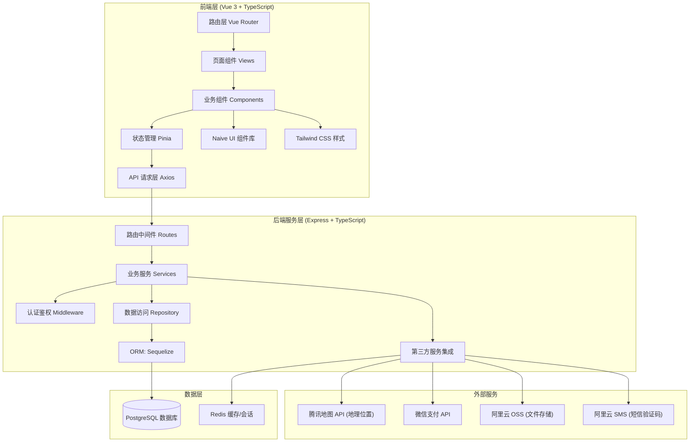
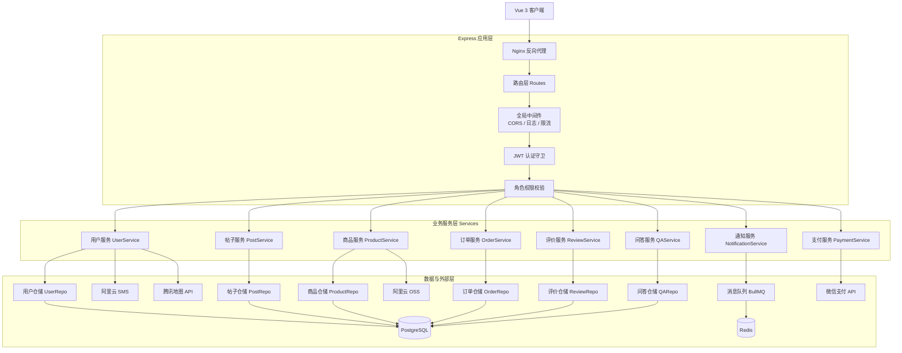

## 1. 架构设计



## 2. 技术选型说明

| 层级 | 技术 | 版本 | 说明 |
|------|------|------|------|
| 前端框架 | Vue 3 | 3.4+ | 使用 Composition API + `<script setup>` 语法 |
| 开发语言 | TypeScript | 5.3+ | 全栈 TypeScript 保证类型安全 |
| 构建工具 | Vite | 5.x | 极速开发体验，原生 ESM 支持 |
| UI 组件库 | Naive UI | 2.38+ | 高质量 Vue 3 组件库，主题定制能力强 |
| CSS 框架 | Tailwind CSS | 3.4+ | 原子化 CSS，配合自定义设计 Token |
| 状态管理 | Pinia | 2.1+ | Vue 官方推荐的状态管理方案 |
| 路由 | Vue Router | 4.2+ | 前端路由，支持懒加载和守卫 |
| HTTP 客户端 | Axios | 1.6+ | 统一请求拦截、响应处理、错误处理 |
| 后端框架 | Express | 4.18+ | 轻量级 Node.js 服务端框架 |
| ORM | Sequelize | 6.35+ | 支持 PostgreSQL 的成熟 ORM，类型定义完善 |
| 数据库 | PostgreSQL | 15+ | 关系型数据库，支持 JSON、全文检索等高级特性 |
| 缓存 | Redis | 7.x | 会话存储、热点数据缓存、消息队列 |
| 文件上传 | Multer + OSS SDK | - | 本地中转上传至阿里云 OSS |
| 加密库 | bcryptjs / crypto-js | - | 密码哈希、敏感数据加密 |
| 认证 | JWT (jsonwebtoken) | - | Token 无状态认证 + Refresh Token 机制 |
| 参数校验 | Zod | 3.22+ | 前后端共享类型定义和校验规则 |
| 测试框架 | Vitest | 1.x | 前端单元测试，与 Vite 无缝集成 |
| API 测试 | Supertest | - | 后端接口集成测试 |
| 代码规范 | ESLint + Prettier | - | 统一代码风格，自动格式化 |

## 3. 路由定义

| 路由路径 | 页面组件 | 说明 |
|----------|----------|------|
| `/` | HomePage.vue | 首页 - 轮播、热门话题、精选商品、专家推荐 |
| `/community` | CommunityList.vue | 社区帖子列表 |
| `/community/:id` | PostDetail.vue | 帖子详情页 |
| `/community/post` | CreatePost.vue | 发布新帖子 |
| `/market` | MarketList.vue | 二手商品列表（搜索筛选） |
| `/market/:id` | ProductDetail.vue | 商品详情页 |
| `/market/publish` | PublishProduct.vue | 发布闲置商品 |
| `/orders` | OrderList.vue | 我的订单列表 |
| `/orders/:id` | OrderDetail.vue | 订单详情与流程进度 |
| `/qa` | QAList.vue | 育儿问答列表 |
| `/qa/:id` | QADetail.vue | 问答详情（付费解锁） |
| `/qa/ask` | AskQuestion.vue | 发起付费提问 |
| `/experts` | ExpertList.vue | 认证专家列表 |
| `/messages` | MessageCenter.vue | 消息通知中心 |
| `/profile` | ProfilePage.vue | 个人中心主页 |
| `/profile/posts` | MyPosts.vue | 我发布的帖子 |
| `/profile/products` | MyProducts.vue | 我发布的商品 |
| `/profile/reviews` | ReviewPage.vue | 评价管理页 |
| `/login` | LoginPage.vue | 登录注册页 |
| `/admin` | AdminDashboard.vue | 管理员后台（需鉴权） |

## 4. API 接口定义

### 4.1 用户模块

```typescript
// 用户相关类型定义
interface User {
  id: number;
  phone: string;
  nickname: string;
  avatar: string;
  gender: 'male' | 'female';
  babyAge?: number;
  city?: string;
  role: 'user' | 'expert' | 'admin';
  creditLevel: number;
  goodReviews: number;
  totalReviews: number;
  isTrustedMom: boolean;
  createdAt: string;
}

// 接口列表
// POST   /api/auth/register          注册
// POST   /api/auth/login             登录（手机号+验证码/密码）
// POST   /api/auth/logout            登出
// POST   /api/auth/sms               发送短信验证码
// GET    /api/user/profile           获取当前用户信息
// PUT    /api/user/profile           更新个人资料
// GET    /api/user/:id               查看任意用户公开信息
```

### 4.2 社区帖子模块

```typescript
interface Post {
  id: number;
  userId: number;
  author: Pick<User, 'id' | 'nickname' | 'avatar' | 'creditLevel' | 'isTrustedMom'>;
  category: 'experience' | 'food' | 'sleep' | 'recovery' | 'other';
  title: string;
  content: string;
  images: string[];
  likeCount: number;
  commentCount: number;
  favoriteCount: number;
  viewCount: number;
  isLiked: boolean;
  isFavorited: boolean;
  status: 'pending' | 'approved' | 'rejected';
  createdAt: string;
}

interface Comment {
  id: number;
  postId: number;
  userId: number;
  author: Pick<User, 'id' | 'nickname' | 'avatar'>;
  parentId: number | null;
  replyTo?: Pick<User, 'id' | 'nickname'>;
  content: string;
  likeCount: number;
  createdAt: string;
}

// 接口列表
// GET    /api/posts                  帖子列表（分页+分类筛选）
// GET    /api/posts/:id              帖子详情
// POST   /api/posts                  创建帖子
// POST   /api/posts/:id/like         点赞/取消点赞
// POST   /api/posts/:id/favorite     收藏/取消收藏
// GET    /api/posts/:id/comments     获取评论列表
// POST   /api/posts/:id/comments     发表评论
// DELETE /api/comments/:id           删除评论
```

### 4.3 商品交易模块

```typescript
type ProductCategory = 'stroller' | 'carseat' | 'crib' | 'toy' | 'clothing' | 'book' | 'other';
type ProductCondition = 'brand_new' | 'like_new' | 'light_use' | 'heavy_use';
type TradeMethod = 'local' | 'express';
type OrderStatus = 'pending_payment' | 'pending_shipment' | 'shipped' | 'pending_review' | 'completed' | 'cancelled';

interface Product {
  id: number;
  userId: number;
  seller: Pick<User, 'id' | 'nickname' | 'avatar' | 'creditLevel' | 'isTrustedMom' | 'city'>;
  category: ProductCategory;
  title: string;
  description: string;
  images: string[];
  condition: ProductCondition;
  originalPrice: number;
  suggestedPriceMin: number;
  suggestedPriceMax: number;
  price: number;
  tradeMethod: TradeMethod[];
  city?: string;
  viewCount: number;
  favoriteCount: number;
  isFavorited: boolean;
  status: 'on_sale' | 'reserved' | 'sold' | 'offline';
  createdAt: string;
}

interface Order {
  id: string;
  productId: number;
  productSnapshot: Product;
  buyerId: number;
  sellerId: number;
  amount: number;
  tradeMethod: TradeMethod;
  status: OrderStatus;
  expressInfo?: { trackingNo: string; carrier: string; address: Address };
  localInfo?: { meetingPlace: string; meetingTime: string };
  buyerReviewed: boolean;
  sellerReviewed: boolean;
  createdAt: string;
  paidAt?: string;
  completedAt?: string;
}

// 接口列表
// GET    /api/products               商品列表（搜索+分类+成色+价格+同城筛选）
// GET    /api/products/:id           商品详情
// POST   /api/products               发布商品
// PUT    /api/products/:id           修改商品
// POST   /api/products/:id/favorite  收藏商品
// GET    /api/products/suggest-price 价格建议（根据品类+成色+原价）
// POST   /api/orders                 创建订单
// GET    /api/orders                 我的订单列表
// GET    /api/orders/:id             订单详情
// POST   /api/orders/:id/pay         订单支付
// POST   /api/orders/:id/ship        发货/确认面交
// POST   /api/orders/:id/receive     确认收货
```

### 4.4 信用评价模块

```typescript
interface Review {
  id: number;
  orderId: string;
  fromUserId: number;
  toUserId: number;
  type: 'good' | 'neutral' | 'bad';
  rating: 1 | 2 | 3 | 4 | 5;
  tags: string[];
  content: string;
  createdAt: string;
}

// 接口列表
// POST   /api/reviews                提交评价
// GET    /api/reviews/user/:userId   查看用户收到的评价
// GET    /api/user/credit-summary    用户信用概览（等级、好评率、历史评价统计）
```

### 4.5 育儿问答模块

```typescript
interface Expert extends User {
  title: string;
  hospital?: string;
  expertise: string[];
  bio: string;
  fee: number;
  watchFee: number;
  rating: number;
  answerCount: number;
  isCertified: boolean;
}

interface Question {
  id: number;
  askerId: number;
  asker: Pick<User, 'id' | 'nickname' | 'avatar'>;
  expertId: number | null;
  expert?: Pick<Expert, 'id' | 'nickname' | 'avatar' | 'title'>;
  category: string;
  title: string;
  content: string;
  images: string[];
  fee: number;
  answer: string | null;
  answeredAt: string | null;
  watchCount: number;
  watchFee: number;
  hasPaid: boolean;
  hasWatched: boolean;
  status: 'pending' | 'answered' | 'expired' | 'refunded';
  createdAt: string;
}

// 接口列表
// GET    /api/experts                专家列表
// GET    /api/experts/:id            专家详情
// GET    /api/questions              问答列表
// GET    /api/questions/:id          问答详情
// POST   /api/questions              发起提问（支付咨询费）
// POST   /api/questions/:id/answer   专家回答
// POST   /api/questions/:id/watch    付费围观
```

### 4.6 消息通知模块

```typescript
type NotificationType = 'system' | 'order' | 'comment' | 'like' | 'chat' | 'qa';

interface Notification {
  id: number;
  userId: number;
  type: NotificationType;
  title: string;
  content: string;
  relatedId: string;
  relatedType: string;
  isRead: boolean;
  createdAt: string;
}

// 接口列表
// GET    /api/notifications          消息列表（按类型筛选）
// POST   /api/notifications/:id/read 标记已读
// POST   /api/notifications/read-all 全部标记已读
// GET    /api/notifications/unread-count 未读数
```

## 5. 服务端架构图



## 6. 数据模型

### 6.1 ER 关系图

```mermaid
erDiagram
    User ||--o{ Post : "发布"
    User ||--o{ Comment : "发表"
    User ||--o{ Product : "发布(卖家)"
    User ||--o{ Order : "购买(买家)"
    User ||--o{ Order : "出售(卖家)"
    User ||--o{ Review : "评价(发出)"
    User ||--o{ Review : "被评(收到)"
    User ||--o{ Question : "提问"
    User ||--o| Expert : "是"
    Expert ||--o{ Question : "回答"
    User ||--o{ Notification : "接收"
    User ||--o{ Favorite : "收藏"

    Post ||--o{ Comment : "包含"
    Post ||--o{ Favorite : "被收藏"
    
    Product ||--o{ Favorite : "被收藏"
    Product ||--o{ Order : "生成"
    
    Order ||--o| Review : "产生(买家)"
    Order ||--o| Review : "产生(卖家)"

    Question ||--o{ Watch : "被围观"

    User {
        bigint id PK "主键"
        string phone UK "手机号"
        string password_hash "密码哈希"
        string nickname "昵称"
        string avatar "头像URL"
        string gender "性别"
        int baby_age "宝宝月龄"
        string city "所在城市"
        string role "角色 user/expert/admin"
        int credit_level "信用等级 1-10"
        int good_reviews "好评数"
        int total_reviews "总评价数"
        boolean is_trusted_mom "诚信宝妈标识"
        datetime created_at "注册时间"
        datetime updated_at "更新时间"
    }

    Post {
        bigint id PK
        bigint user_id FK
        string category "经验/辅食/睡眠/产后/其他"
        string title "标题"
        text content "正文"
        jsonb images "图片数组"
        int like_count "点赞数"
        int comment_count "评论数"
        int favorite_count "收藏数"
        int view_count "浏览量"
        string status "审核状态"
        datetime created_at
    }

    Comment {
        bigint id PK
        bigint post_id FK
        bigint user_id FK
        bigint parent_id FK "父评论ID"
        bigint reply_to_user_id FK "回复给谁"
        text content
        int like_count
        datetime created_at
    }

    Product {
        bigint id PK
        bigint user_id FK
        string category "品类"
        string title
        text description
        jsonb images
        string condition "成色等级"
        decimal original_price "原价"
        decimal suggested_min "建议最低价"
        decimal suggested_max "建议最高价"
        decimal price "售价"
        jsonb trade_methods "交易方式"
        string city "城市"
        int view_count
        int favorite_count
        string status "on_sale/reserved/sold/offline"
        datetime created_at
    }

    Order {
        string id PK "订单号"
        bigint product_id FK
        bigint buyer_id FK
        bigint seller_id FK
        decimal amount
        string trade_method "local/express"
        jsonb product_snapshot "商品快照"
        jsonb express_info "快递信息"
        jsonb local_info "面交信息"
        string status "订单状态"
        boolean buyer_reviewed
        boolean seller_reviewed
        datetime created_at
        datetime paid_at
        datetime completed_at
    }

    Review {
        bigint id PK
        string order_id FK
        bigint from_user_id FK
        bigint to_user_id FK
        string type "good/neutral/bad"
        int rating "1-5星"
        jsonb tags "评价标签"
        text content
        datetime created_at
    }

    Expert {
        bigint user_id PK FK
        string title "职称"
        string hospital "所属医院"
        jsonb expertise "擅长领域"
        text bio "个人简介"
        decimal fee "咨询费用"
        decimal watch_fee "围观费用"
        decimal rating "综合评分"
        int answer_count "回答数"
        boolean is_certified "是否认证"
    }

    Question {
        bigint id PK
        bigint asker_id FK
        bigint expert_id FK
        string category
        string title
        text content
        jsonb images
        decimal fee
        text answer
        datetime answered_at
        int watch_count
        decimal watch_fee
        string status
        datetime created_at
    }

    Notification {
        bigint id PK
        bigint user_id FK
        string type "消息类型"
        string title
        text content
        string related_id
        string related_type
        boolean is_read
        datetime created_at
    }

    Favorite {
        bigint id PK
        bigint user_id FK
        string target_type "post/product"
        bigint target_id
        datetime created_at
    }

    Watch {
        bigint id PK
        bigint user_id FK
        bigint question_id FK
        decimal fee_paid
        datetime created_at
    }
```

### 6.2 数据库 DDL

```sql
-- ========================================
-- 母婴社区平台 PostgreSQL 数据库初始化脚本
-- ========================================

CREATE EXTENSION IF NOT EXISTS "uuid-ossp";

-- 用户表
CREATE TABLE users (
    id BIGSERIAL PRIMARY KEY,
    phone VARCHAR(20) UNIQUE NOT NULL,
    password_hash VARCHAR(255) NOT NULL,
    nickname VARCHAR(50) NOT NULL,
    avatar VARCHAR(500) DEFAULT '',
    gender VARCHAR(10) CHECK (gender IN ('male', 'female')),
    baby_age INTEGER,
    city VARCHAR(50),
    role VARCHAR(20) NOT NULL DEFAULT 'user' CHECK (role IN ('user', 'expert', 'admin')),
    credit_level INTEGER NOT NULL DEFAULT 1 CHECK (credit_level BETWEEN 1 AND 10),
    good_reviews INTEGER NOT NULL DEFAULT 0,
    total_reviews INTEGER NOT NULL DEFAULT 0,
    is_trusted_mom BOOLEAN NOT NULL DEFAULT FALSE,
    created_at TIMESTAMP NOT NULL DEFAULT CURRENT_TIMESTAMP,
    updated_at TIMESTAMP NOT NULL DEFAULT CURRENT_TIMESTAMP
);
CREATE INDEX idx_users_city ON users(city);
CREATE INDEX idx_users_credit ON users(credit_level DESC);

-- 专家信息表
CREATE TABLE experts (
    user_id BIGINT PRIMARY KEY REFERENCES users(id) ON DELETE CASCADE,
    title VARCHAR(100) NOT NULL,
    hospital VARCHAR(200),
    expertise JSONB NOT NULL DEFAULT '[]',
    bio TEXT,
    fee DECIMAL(10,2) NOT NULL DEFAULT 29.90,
    watch_fee DECIMAL(10,2) NOT NULL DEFAULT 1.90,
    rating DECIMAL(3,2) NOT NULL DEFAULT 5.00,
    answer_count INTEGER NOT NULL DEFAULT 0,
    is_certified BOOLEAN NOT NULL DEFAULT FALSE,
    created_at TIMESTAMP NOT NULL DEFAULT CURRENT_TIMESTAMP,
    updated_at TIMESTAMP NOT NULL DEFAULT CURRENT_TIMESTAMP
);

-- 社区帖子表
CREATE TABLE posts (
    id BIGSERIAL PRIMARY KEY,
    user_id BIGINT NOT NULL REFERENCES users(id) ON DELETE CASCADE,
    category VARCHAR(20) NOT NULL CHECK (category IN ('experience', 'food', 'sleep', 'recovery', 'other')),
    title VARCHAR(200) NOT NULL,
    content TEXT NOT NULL,
    images JSONB NOT NULL DEFAULT '[]',
    like_count INTEGER NOT NULL DEFAULT 0,
    comment_count INTEGER NOT NULL DEFAULT 0,
    favorite_count INTEGER NOT NULL DEFAULT 0,
    view_count INTEGER NOT NULL DEFAULT 0,
    status VARCHAR(20) NOT NULL DEFAULT 'approved' CHECK (status IN ('pending', 'approved', 'rejected')),
    created_at TIMESTAMP NOT NULL DEFAULT CURRENT_TIMESTAMP,
    updated_at TIMESTAMP NOT NULL DEFAULT CURRENT_TIMESTAMP
);
CREATE INDEX idx_posts_user ON posts(user_id);
CREATE INDEX idx_posts_category_created ON posts(category, created_at DESC);
CREATE INDEX idx_posts_status_created ON posts(status, created_at DESC);

-- 评论表
CREATE TABLE comments (
    id BIGSERIAL PRIMARY KEY,
    post_id BIGINT NOT NULL REFERENCES posts(id) ON DELETE CASCADE,
    user_id BIGINT NOT NULL REFERENCES users(id) ON DELETE CASCADE,
    parent_id BIGINT REFERENCES comments(id) ON DELETE CASCADE,
    reply_to_user_id BIGINT REFERENCES users(id) ON DELETE SET NULL,
    content TEXT NOT NULL,
    like_count INTEGER NOT NULL DEFAULT 0,
    created_at TIMESTAMP NOT NULL DEFAULT CURRENT_TIMESTAMP
);
CREATE INDEX idx_comments_post ON comments(post_id, created_at DESC);
CREATE INDEX idx_comments_user ON comments(user_id);

-- 商品表
CREATE TABLE products (
    id BIGSERIAL PRIMARY KEY,
    user_id BIGINT NOT NULL REFERENCES users(id) ON DELETE CASCADE,
    category VARCHAR(30) NOT NULL CHECK (category IN ('stroller','carseat','crib','toy','clothing','book','other')),
    title VARCHAR(200) NOT NULL,
    description TEXT NOT NULL,
    images JSONB NOT NULL DEFAULT '[]',
    condition VARCHAR(20) NOT NULL CHECK (condition IN ('brand_new','like_new','light_use','heavy_use')),
    original_price DECIMAL(10,2) NOT NULL,
    suggested_min DECIMAL(10,2) NOT NULL,
    suggested_max DECIMAL(10,2) NOT NULL,
    price DECIMAL(10,2) NOT NULL,
    trade_methods JSONB NOT NULL DEFAULT '["local","express"]',
    city VARCHAR(50),
    view_count INTEGER NOT NULL DEFAULT 0,
    favorite_count INTEGER NOT NULL DEFAULT 0,
    status VARCHAR(20) NOT NULL DEFAULT 'on_sale' CHECK (status IN ('on_sale','reserved','sold','offline')),
    created_at TIMESTAMP NOT NULL DEFAULT CURRENT_TIMESTAMP,
    updated_at TIMESTAMP NOT NULL DEFAULT CURRENT_TIMESTAMP
);
CREATE INDEX idx_products_user ON products(user_id);
CREATE INDEX idx_products_category_status ON products(category, status, created_at DESC);
CREATE INDEX idx_products_price ON products(price);
CREATE INDEX idx_products_city ON products(city);
CREATE INDEX idx_products_condition ON products(condition);

-- 订单表
CREATE TABLE orders (
    id VARCHAR(32) PRIMARY KEY,
    product_id BIGINT NOT NULL REFERENCES products(id),
    buyer_id BIGINT NOT NULL REFERENCES users(id),
    seller_id BIGINT NOT NULL REFERENCES users(id),
    amount DECIMAL(10,2) NOT NULL,
    trade_method VARCHAR(20) NOT NULL CHECK (trade_method IN ('local', 'express')),
    product_snapshot JSONB NOT NULL,
    express_info JSONB,
    local_info JSONB,
    status VARCHAR(30) NOT NULL DEFAULT 'pending_payment' CHECK (status IN ('pending_payment','pending_shipment','shipped','pending_review','completed','cancelled')),
    buyer_reviewed BOOLEAN NOT NULL DEFAULT FALSE,
    seller_reviewed BOOLEAN NOT NULL DEFAULT FALSE,
    created_at TIMESTAMP NOT NULL DEFAULT CURRENT_TIMESTAMP,
    paid_at TIMESTAMP,
    completed_at TIMESTAMP
);
CREATE INDEX idx_orders_buyer ON orders(buyer_id, created_at DESC);
CREATE INDEX idx_orders_seller ON orders(seller_id, created_at DESC);
CREATE INDEX idx_orders_status ON orders(status);

-- 评价表
CREATE TABLE reviews (
    id BIGSERIAL PRIMARY KEY,
    order_id VARCHAR(32) NOT NULL REFERENCES orders(id) ON DELETE CASCADE,
    from_user_id BIGINT NOT NULL REFERENCES users(id),
    to_user_id BIGINT NOT NULL REFERENCES users(id),
    type VARCHAR(10) NOT NULL CHECK (type IN ('good', 'neutral', 'bad')),
    rating INTEGER NOT NULL CHECK (rating BETWEEN 1 AND 5),
    tags JSONB NOT NULL DEFAULT '[]',
    content TEXT,
    created_at TIMESTAMP NOT NULL DEFAULT CURRENT_TIMESTAMP
);
CREATE UNIQUE INDEX idx_reviews_order_from ON reviews(order_id, from_user_id);
CREATE INDEX idx_reviews_to_user ON reviews(to_user_id, created_at DESC);

-- 问答表
CREATE TABLE questions (
    id BIGSERIAL PRIMARY KEY,
    asker_id BIGINT NOT NULL REFERENCES users(id),
    expert_id BIGINT REFERENCES users(id),
    category VARCHAR(50) NOT NULL,
    title VARCHAR(200) NOT NULL,
    content TEXT NOT NULL,
    images JSONB NOT NULL DEFAULT '[]',
    fee DECIMAL(10,2) NOT NULL,
    answer TEXT,
    answered_at TIMESTAMP,
    watch_count INTEGER NOT NULL DEFAULT 0,
    watch_fee DECIMAL(10,2) NOT NULL DEFAULT 1.90,
    status VARCHAR(20) NOT NULL DEFAULT 'pending' CHECK (status IN ('pending','answered','expired','refunded')),
    created_at TIMESTAMP NOT NULL DEFAULT CURRENT_TIMESTAMP
);
CREATE INDEX idx_questions_asker ON questions(asker_id, created_at DESC);
CREATE INDEX idx_questions_expert ON questions(expert_id, created_at DESC);
CREATE INDEX idx_questions_status ON questions(status, created_at DESC);

-- 围观记录表
CREATE TABLE watches (
    id BIGSERIAL PRIMARY KEY,
    user_id BIGINT NOT NULL REFERENCES users(id),
    question_id BIGINT NOT NULL REFERENCES questions(id) ON DELETE CASCADE,
    fee_paid DECIMAL(10,2) NOT NULL,
    created_at TIMESTAMP NOT NULL DEFAULT CURRENT_TIMESTAMP,
    UNIQUE(user_id, question_id)
);

-- 通知表
CREATE TABLE notifications (
    id BIGSERIAL PRIMARY KEY,
    user_id BIGINT NOT NULL REFERENCES users(id) ON DELETE CASCADE,
    type VARCHAR(20) NOT NULL CHECK (type IN ('system','order','comment','like','chat','qa')),
    title VARCHAR(100) NOT NULL,
    content TEXT NOT NULL,
    related_id VARCHAR(50),
    related_type VARCHAR(30),
    is_read BOOLEAN NOT NULL DEFAULT FALSE,
    created_at TIMESTAMP NOT NULL DEFAULT CURRENT_TIMESTAMP
);
CREATE INDEX idx_notifications_user_read ON notifications(user_id, is_read, created_at DESC);

-- 收藏表
CREATE TABLE favorites (
    id BIGSERIAL PRIMARY KEY,
    user_id BIGINT NOT NULL REFERENCES users(id) ON DELETE CASCADE,
    target_type VARCHAR(20) NOT NULL CHECK (target_type IN ('post', 'product')),
    target_id BIGINT NOT NULL,
    created_at TIMESTAMP NOT NULL DEFAULT CURRENT_TIMESTAMP,
    UNIQUE(user_id, target_type, target_id)
);

-- 点赞记录表
CREATE TABLE likes (
    id BIGSERIAL PRIMARY KEY,
    user_id BIGINT NOT NULL REFERENCES users(id) ON DELETE CASCADE,
    target_type VARCHAR(20) NOT NULL CHECK (target_type IN ('post', 'comment')),
    target_id BIGINT NOT NULL,
    created_at TIMESTAMP NOT NULL DEFAULT CURRENT_TIMESTAMP,
    UNIQUE(user_id, target_type, target_id)
);

-- ========================================
-- 初始化种子数据
-- ========================================

-- 插入测试用户（密码均为 123456，哈希值为 bcrypt 生成）
INSERT INTO users (phone, password_hash, nickname, avatar, gender, baby_age, city, role, credit_level, good_reviews, total_reviews, is_trusted_mom) VALUES
('13800000001', '$2a$10$N9qo8uLOickgx2ZMRZoMyeIjZAgcfl7p92ldGxad68LJZdL17lhWy', '甜心妈妈', '', 'female', 8, '上海市', 'user', 5, 42, 45, TRUE),
('13800000002', '$2a$10$N9qo8uLOickgx2ZMRZoMyeIjZAgcfl7p92ldGxad68LJZdL17lhWy', '豆豆妈', '', 'female', 15, '北京市', 'user', 4, 28, 30, FALSE),
('13800000003', '$2a$10$N9qo8uLOickgx2ZMRZoMyeIjZAgcfl7p92ldGxad68LJZdL17lhWy', '李医生', '', 'female', 36, '上海市', 'expert', 8, 120, 125, TRUE),
('13800000004', '$2a$10$N9qo8uLOickgx2ZMRZoMyeIjZAgcfl7p92ldGxad68LJZdL17lhWy', '王育儿师', '', 'female', 48, '广州市', 'expert', 7, 88, 90, TRUE),
('13800000005', '$2a$10$N9qo8uLOickgx2ZMRZoMyeIjZAgcfl7p92ldGxad68LJZdL17lhWy', '果果妈咪', '', 'female', 6, '深圳市', 'user', 3, 12, 15, FALSE);

-- 插入专家信息
INSERT INTO experts (user_id, title, hospital, expertise, bio, fee, watch_fee, rating, answer_count, is_certified) VALUES
(3, '儿科主治医师', '上海儿童医学中心', '["新生儿护理","婴儿喂养","常见疾病"]', '从事儿科临床工作10年，擅长婴幼儿常见病诊治与喂养指导。', 39.90, 2.90, 4.90, 156, TRUE),
(4, '高级育婴师', ' - ', '["辅食添加","睡眠训练","早期教育"]', '国家认证高级育婴师，专注0-3岁婴幼儿照护指导。', 29.90, 1.90, 4.85, 203, TRUE);

-- 插入示例帖子
INSERT INTO posts (user_id, category, title, content, images, like_count, comment_count, favorite_count, view_count) VALUES
(1, 'food', '6个月宝宝辅食添加全攻略，新手妈妈必看！', '宝宝满6个月就可以开始添加辅食啦！第一口辅食推荐高铁米粉，遵循由少到多、由稀到稠、由细到粗的原则...', '[]', 128, 36, 456, 2341),
(2, 'sleep', '分享我家宝宝自主入睡训练的30天历程', '从抱睡到自主入睡，整整用了一个月...建立固定睡前仪式非常重要：洗澡→抚触→喂奶→讲故事→关灯...', '[]', 256, 89, 678, 4521),
(1, 'recovery', '产后42天复查归来，分享盆底肌恢复心得', '顺产的妈妈一定要重视盆底肌恢复！不要急于做剧烈运动，凯格尔运动要坚持做，每天3组每组10次...', '[]', 189, 52, 234, 1876);

-- 插入示例商品
INSERT INTO products (user_id, category, title, description, images, condition, original_price, suggested_min, suggested_max, price, trade_methods, city) VALUES
(1, 'stroller', '9成新博格步婴儿车 Bee5 轻便折叠', '购入一年半，使用频率不高，车架完好无磕碰，配件齐全含雨罩蚊帐。宝宝大了用不上了，低价转。', '[]', 'light_use', 6800.00, 2040.00, 4760.00, 2980.00, '["local","express"]', '上海市'),
(2, 'carseat', '全新宝得适儿童安全座椅 双面骑士II', '朋友送的礼物，宝宝已经有一个了，全新未拆封，正规渠道购买，全国联保。', '[]', 'brand_new', 3680.00, 1104.00, 2576.00, 2200.00, '["local","express"]', '北京市'),
(5, 'toy', '费雪启蒙早教玩具大礼包 几乎全新', '包含认知卡片、音乐琴、叠叠乐等8件玩具，宝宝兴趣不在这上面，买来基本没玩过。', '[]', 'like_new', 599.00, 180.00, 419.00, 280.00, '["express"]', '深圳市'),
(1, 'book', '儿童绘本30本打包转 适合2-4岁', '包含猜猜我有多爱你、好饿的毛毛虫、大卫不可以等经典绘本，书角略有卷起但不影响阅读。', '[]', 'light_use', 860.00, 258.00, 602.00, 350.00, '["local","express"]', '上海市'),
(2, 'clothing', '品牌童装打包20件 尺码90-100', '包含巴拉巴拉、全棉时代等品牌，春秋冬款都有，大部分只穿过几次，宝宝长太快穿不下了。', '[]', 'heavy_use', 1200.00, 360.00, 840.00, 380.00, '["local","express"]', '北京市');

-- 插入示例问题
INSERT INTO questions (asker_id, expert_id, category, title, content, images, fee, answer, answered_at, watch_count, watch_fee, status) VALUES
(5, 3, '喂养', '宝宝7个月不爱吃辅食怎么办？', '宝宝刚满7个月，每次喂辅食都紧闭嘴巴，勺子一靠近就摇头，只愿意喝母乳，体重增长也变慢了，要不要去医院检查？', '[]', 39.90, '宝宝刚接触辅食需要适应期，建议：1.营造轻松的进食氛围，不要强迫；2.尝试多样化口味和质地；3.让宝宝参与进食过程（手抓食物）；4.与大人同桌吃饭模仿；5.观察是否有出牙不适。如持续2周以上且体重不增，建议就诊。', CURRENT_TIMESTAMP - INTERVAL '1 day', 156, 2.90, 'answered'),
(1, 4, '睡眠', '10个月宝宝夜醒频繁怎么改善？', '宝宝10个月，每晚醒3-4次，每次都要抱起来哄才能再次入睡，大人累垮了，试过哭声免疫法不忍心，求助！', '[]', 29.90, NULL, NULL, 0, 1.90, 'pending');
```
