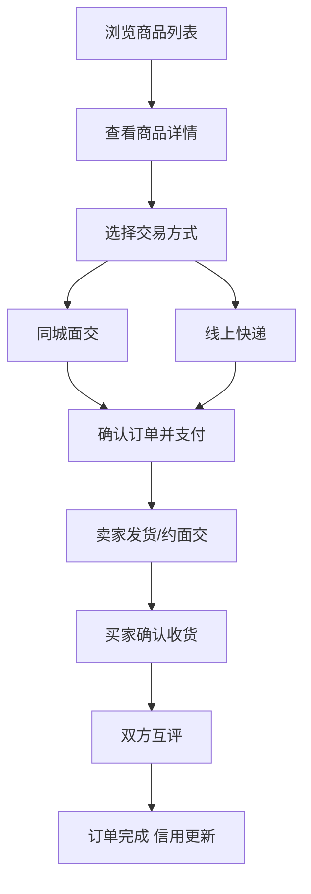
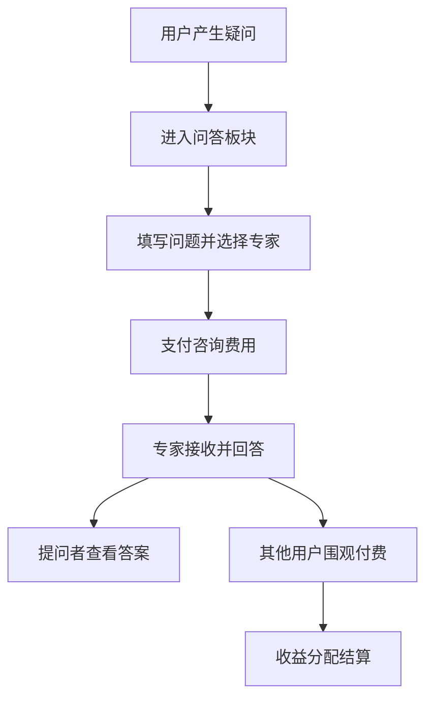
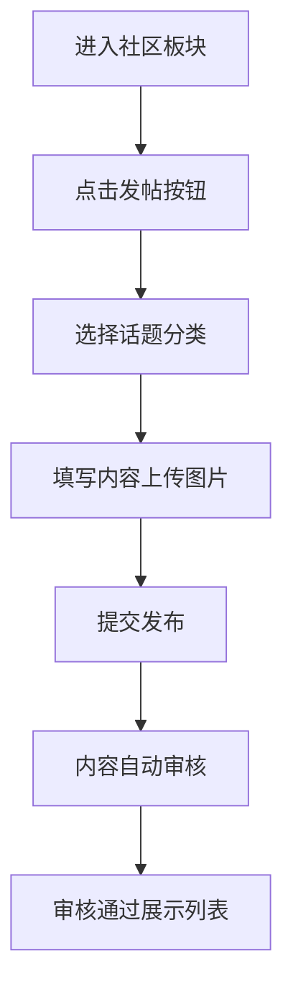

## 1. 产品概述

母婴闲置交易与交流社区平台，是面向宝妈群体的垂直社交电商平台，致力于解决育儿知识获取困难、母婴闲置物品流转不畅、专业育儿咨询门槛高等痛点。平台集社区交流、二手交易、信用评价、付费问答于一体，打造安全、温暖、专业的宝妈互助生态圈。

## 2. 核心功能

### 2.1 用户角色

| 角色 | 注册方式 | 核心权限 |
|------|----------|----------|
| 普通用户（宝妈） | 手机号/微信注册 | 浏览内容、发帖互动、发布/购买商品、评价交易、提问咨询 |
| 认证专家 | 资质认证申请 + 审核 | 普通用户权限 + 回答付费提问、设置咨询费用、查看围观收益 |
| 平台管理员 | 后台邀请制 | 用户管理、内容审核、商品审核、专家认证审核、数据统计 |

### 2.2 功能模块

1. **首页**：导航栏、轮播 Banner、热门话题推荐、精选商品、专家推荐
2. **社区交流板块**：发帖、帖子列表、帖子详情、评论、点赞、收藏、话题分类
3. **二手交易板块**：商品发布、商品搜索、商品分类、商品详情、成色标注、价格建议
4. **交易系统**：同城面交、线上支付、快递配送、订单管理
5. **信用评价体系**：交易互评、信用等级、诚信宝妈标识
6. **育儿问答模块**：付费提问、专家回答、围观查看、收益结算
7. **个人中心**：用户信息、我的商品、我的订单、我的帖子、消息通知、信用等级

### 2.3 页面详情

| 页面名称 | 模块名称 | 功能描述 |
|----------|----------|----------|
| 首页 | 顶部导航栏 | Logo、搜索框、导航菜单（首页/社区/交易/问答/消息/我的）、登录注册入口 |
| 首页 | 轮播 Banner | 平台活动、热门话题、精选商品推广图，支持自动轮播和手动切换 |
| 首页 | 热门话题 | 展示社区热门讨论话题卡片，点击进入话题下帖子列表 |
| 首页 | 精选商品 | 推荐高性价比闲置母婴商品，支持按分类筛选 |
| 首页 | 专家推荐 | 展示认证育儿专家/儿科医生卡片，显示简介、擅长领域、咨询费用 |
| 社区列表页 | 分类 Tab | 经验分享/辅食制作/睡眠训练/产后恢复/其他 主题分类 |
| 社区列表页 | 帖子卡片 | 展示帖子标题、摘要、作者头像、发布时间、点赞/评论/收藏数 |
| 社区列表页 | 发帖按钮 | 悬浮按钮，点击弹出发帖表单 |
| 帖子详情页 | 帖子内容 | 完整帖子标题、正文、图片/视频、作者信息、发布时间 |
| 帖子详情页 | 互动区 | 点赞、收藏、评论输入框、评论列表（支持多级回复） |
| 商品列表页 | 搜索与筛选 | 关键词搜索、品类筛选（婴儿车/安全座椅/婴儿床/玩具/童装/绘本等）、成色筛选、价格区间筛选、同城筛选 |
| 商品列表页 | 商品卡片 | 商品主图、标题、成色标签、价格、原价对比、卖家城市、卖家信用标识 |
| 商品发布页 | 商品表单 | 品类选择、标题、描述、多图上传、成色选择（全新/99新/轻微使用痕迹/明显使用痕迹）、原价输入、建议价格区间展示、售价设置、交易方式选择（同城面交/快递）、城市选择 |
| 商品详情页 | 商品信息 | 图片轮播、标题、成色标签、价格（显示原价折扣）、成色说明、卖家信息（头像、昵称、信用等级、诚信标识）、城市 |
| 商品详情页 | 交易操作 | 与卖家聊天、立即购买、选择交易方式（面交地点选择/快递地址填写） |
| 订单列表页 | 订单卡片 | 订单状态标签（待付款/待发货/待收货/待评价/已完成）、商品信息、交易金额、操作按钮 |
| 订单详情页 | 订单流程 | 交易进度条、订单信息、支付信息、物流信息/面交信息、评价入口 |
| 问答列表页 | 问题卡片 | 问题标题、问题分类、提问时间、提问者、回答专家、围观人数、围观费用（已付费/未付费状态） |
| 提问页 | 提问表单 | 问题分类、问题标题、问题描述、选择专家（可选）、图片上传、费用显示与确认支付 |
| 问答详情页 | 问答内容 | 问题全文、专家回答（付费解锁）、围观按钮、评论互动区 |
| 个人中心 | 用户信息区 | 头像、昵称、信用等级、诚信宝妈标识、好评率、统计数据（发帖数/商品数/交易数） |
| 个人中心 | 功能菜单 | 我的帖子、我的商品、我的订单、我的提问、我的回答、我的收藏、消息通知、账号设置 |
| 信用评价页 | 评价表单 | 星级评分、好评/中评/差评、文字评价、评价标签选择 |
| 登录注册页 | 表单模块 | 手机号输入、验证码登录、密码登录、微信快捷登录、用户协议勾选 |
| 消息通知页 | 消息分类 | 系统通知、交易消息、评论消息、点赞收藏消息、聊天消息 |

## 3. 核心流程

### 3.1 商品交易流程

用户浏览商品 → 进入商品详情 → 点击购买 → 选择交易方式（同城面交/线上快递）→ 确认订单并支付 → 卖家发货/约定面交 → 买家确认收货/面交完成 → 双方互评 → 订单完成，信用等级更新

### 3.2 育儿问答流程

用户有育儿疑问 → 进入问答板块 → 填写问题表单 → 选择专家（可选）→ 支付咨询费用 → 专家收到通知 → 专家回答问题 → 其他用户可付费围观 → 双方收益结算

### 3.3 社区发帖流程

用户进入社区 → 点击发帖按钮 → 选择话题分类 → 填写标题与正文 → 上传图片/视频 → 提交发布 → 内容审核 → 审核通过后展示在社区列表

## 4. 用户界面设计

### 4.1 设计风格

- **主色调**：温柔粉色系 `#FF8BA7` 作为品牌主色，传递温暖、亲切、母婴友好的品牌调性
- **辅助色**：奶油米色 `#FFF5F0` 作为大面积背景色，薄荷绿 `#82D9B6` 作为成功/健康状态色，淡紫色 `#C8B6FF` 用于专家/付费相关视觉标识
- **中性色**：深灰 `#2D3436` 正文文字，中灰 `#636E72` 次级文字，浅灰 `#DFE6E9` 边框分割线，纯白 `#FFFFFF` 卡片背景
- **按钮风格**：圆角 12px，主按钮使用渐变粉（`#FF8BA7` → `#FF6B8A`）带柔和阴影，悬浮时轻微上浮 + 阴影加深；次要按钮使用白色底 + 主色边框
- **字体**：中文使用「思源黑体」，英文数字使用「DM Sans」，标题字重 600-700，正文字重 400
- **字号阶梯**：32px（页面大标题）、24px（板块标题）、18px（卡片标题）、14px（正文）、12px（辅助说明）
- **布局风格**：卡片式布局，卡片圆角 16px，卡片悬浮 0 2 8px 柔和阴影；顶部导航固定，主内容区 1200px 居中，栅格系统 12 列
- **图标风格**：线性圆润图标，统一 2px 线宽，与文字同色或主色调

### 4.2 页面设计概览

| 页面名称 | 模块名称 | UI 元素 |
|----------|----------|----------|
| 首页 | 导航栏 | 白底，品牌 Logo（粉色母婴图形），顶部导航链接 hover 粉色下划线，搜索框圆角 20px 浅灰边框，登录按钮空心描边，注册按钮实心渐变 |
| 首页 | 轮播 Banner | 圆角 24px，高度 360px，粉色渐变遮罩 + 白色大标题，左文字右图片布局，下方圆角指示器 |
| 首页 | 卡片网格 | 两栏式布局：左侧热门话题（粉色渐变卡片带话题标签），右侧精选商品卡片（商品图 + 成色角标 + 价格） |
| 社区列表页 | 分类 Tab | 横向滚动胶囊按钮，选中态实心粉底白字，未选中浅灰底深灰字，间距 8px |
| 商品列表页 | 筛选区 | 白底卡片，分类按钮组，成色标签（全新绿/99新蓝/轻微橙/明显灰），滑块式价格区间选择器 |
| 商品详情页 | 成色展示 | 大号成色徽章（带对勾图标），详细成色说明文字，价格区显示原价划线 + 现价 + 折扣率标签 |
| 个人中心 | 信用展示 | 信用等级进度条（渐变填充），诚信宝妈金色徽章，好评率圆形进度环，统计数据卡片 |
| 问答详情页 | 付费遮罩 | 回答内容前 2 行可见，后续使用渐变模糊遮罩 + 「付费围观解锁」按钮（淡紫色渐变） |

### 4.3 响应式设计

- **设计策略**：桌面端优先（1200px 栅格），向下适配平板（768px）和移动端（375px）
- **断点设置**：≥1200px（桌面四栏）、768px-1199px（平板两栏）、<768px（移动端单栏）
- **适配规则**：
  - 导航栏：桌面顶部横排，移动端变为底部 Tab Bar + 顶部极简导航
  - 卡片网格：桌面 4 列 → 平板 2 列 → 移动 1 列
  - 字号：移动端标题缩小 4px，正文缩小 2px，间距压缩 25%
  - 悬浮发帖按钮：移动端固定右下角，增大触控区域至 56px
  - 表单控件：移动端输入框、按钮高度统一提升至 48px 确保触控友好

### 4.4 微交互与动画

- 页面加载：元素错落入场（延迟 50ms 递增），使用淡入 + 向上位移 10px 组合动画
- 卡片交互：hover 时 `translateY(-4px)` + 阴影加深 + 轻微粉色辉光，过渡 200ms ease-out
- 点赞按钮：点击时图标从空心变实心 + 心形弹跳缩放 1.2→1 动画 + 粉色数字 +1 飘字
- 发布成功：顶部 Toast 滑入 + 绿色对勾图标动画 + "发布成功" 文案
- 信用等级提升：全屏弹窗 + 彩纸粒子动效 + 新等级徽章放大展示
